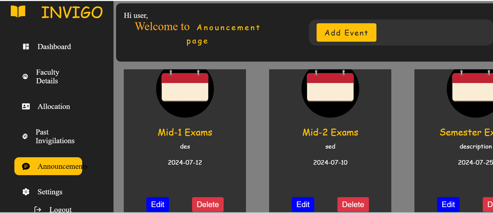

<div align="center">
  
</div>

## Invigilation Management System

The **Invigilation Management System** serves as a centralized repository for securely storing and tracking invigilation records of teaching staff in an educational institution. Authorized users can efficiently access and search the database for specific staff members' invigilation schedules and assignments. This digital solution eliminates manual paperwork, saving time and promoting transparency.

## Features
- **Centralized Record Management**: Store all invigilation records in a secure, easily accessible database.
- **Search Functionality**: Quickly search for specific staff members and view their invigilation schedules.
- **Role-Based Access**: Ensure only authorized users can access or modify records.
- **Security**: Enhanced security using **JWT Web Tokens** for authentication and secure data access.
- **Efficiency**: Eliminate manual paperwork and streamline administrative processes.

## Technologies Used
<table align="center">
  <tr>
    <td align="center" width="110">
      
      <br><strong>Express</strong>
    </td>
    <td align="center" width="110">
      
      <br><strong>MongoDB</strong>
    </td>
     <td align="center" width="110">
      
      <br><strong>Node.js</strong>
    </td>
    <td align="center" width="110">
      
      <br><strong>React</strong>
    </td>
  </tr>
</table>

## 🛠 Setup & Installation

1. **Clone the repository**
```bash
git clone https://github.com/Somepalli-Venkatesh/invigilation
```

2. **Install dependencies for the root**
```bash
npm install
```
3. **Start the frontend**
```bash
cd frontend
npm install
npm run dev
```

4. **Set up the backend**
```bash
cd backend
npm install
```

5. **Start the backend**
```bash
npm start
```

## 📸 Workflow ▶

<table>
  <tr>
    <td width="50%" align="center">
      
      <p><strong>Home Page</strong></p>
    </td>
    <td width="50%" align="center">
      
      <p><strong>Login Process</strong></p>
    </td>
  </tr>
  <tr>
    <td width="50%" align="center">
      
      <p><strong>Registration Page</strong></p>
    </td>
    <td width="50%" align="center">
      
      <p><strong>Dashboard</strong></p>
    </td>
  </tr>
  <tr>
    <td width="50%" align="center">
      
      <p><strong>Faculty Details</strong></p>
    </td>
    <td width="50%" align="center">
      
      <p><strong>Allocation Page</strong></p>
    </td>
  </tr>
  <tr>
    <td width="50%" align="center">
      
      <p><strong>select rooms and faculty</strong></p>
    </td>
    <td width="50%" align="center">
      
      <p><strong>Random Allocation</strong></p>
    </td>
  </tr>
 <tr>
    <td width="50%" align="center">
      
      <p><strong>Add details to generate pdf</strong></p>
    </td>
    <td width="50%" align="center">
      
      <p><strong>Downloaded pdf</strong></p>
    </td>
  </tr>
   <tr>
    <td width="50%" align="center">
      
      <p><strong>Past Invigilations</strong></p>
    </td>
    <td width="50%" align="center">
      
      <p><strong>Announcements</strong></p>
    </td>
  </tr>
</table>


